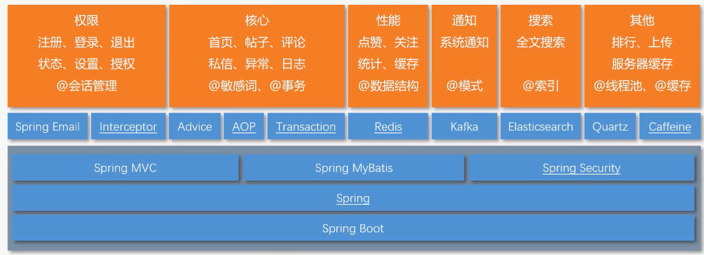
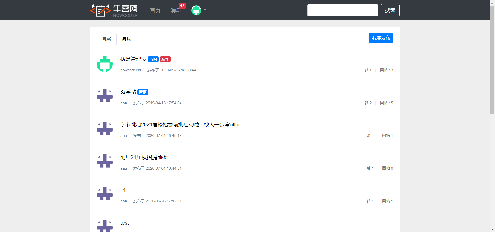
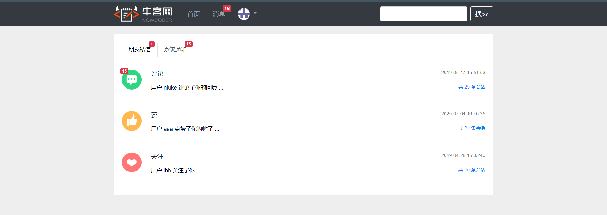

## 项目介绍
一个仿照牛客网实现的讨论社区，不仅实现了基本的注册，登录，发帖，评论，点赞，回复功能，同时使用前缀树实现敏感词过滤，使用wkhtmltopdf生成长图和pdf，实现网站UV和DAU统计，并将用户头像等信息存于七牛云服务器。
## 其他项目
* 计算机类电子书仓库：https://github.com/cosen1024/awesome-cs-books
* Java面试题仓库：https://github.com/cosen1024/Java-Interview
## 项目演示
演示地址: http://coolsen.cn/  
账号密码: aaa/aaa
## 技术选型

## 功能简介
* 使用Spring Security 做权限控制，替代拦截器的拦截控制，并使用自己的认证方案替代Security 认证流程，使权限认证和控制更加方便灵活。
* 使用Redis的set实现点赞，zset实现关注，并使用Redis存储登录ticket和验证码，解决分布式session问题。 
* 使用Redis高级数据类型HyperLogLog统计UV(Unique Visitor),使用Bitmap统计DAU(Daily Active User)。
* 使用Kafka处理发送评论、点赞和关注等系统通知，并使用事件进行封装，构建了强大的异步消息系统。 
* 使用Elasticsearch做全局搜索，并通过事件封装，增加关键词高亮显示等功能。 
* 对热帖排行模块，使用分布式缓存Redis和本地缓存Caffeine作为多级缓存，避免了缓存雪崩，将QPS提升了20倍(10-200)，大大提升了网站访问速度。并使用Quartz定时更新热帖排行。 

## 开发环境

| 工具          | 版本号 | 下载                              |
| ------------- | ------ | --------------------------------- |
| JDK           | 11     | https://openjdk.java.net/install/ |
| Mysql         | 5.7    | https://www.mysql.com/            |
| Redis         | 3.2    | https://redis.io/download         |
| Elasticsearch | 6.4.3  | https://www.elastic.co/downloads  |
| Kafka         | 2.3.0  |   https://kafka.apache.org/downloads                                |
| nginx         | 1.10   | http://nginx.org/en/download.html | 
## 运行效果展示
* 首页

* 消息

## 后续更新点
* 增加收藏功能
* 增强对话框功能
## 相关资源
[相关的教程](https://pan.baidu.com/s/1LjYYwJVsqNBxq69udsXMvA):网盘提取码：wxdd 

